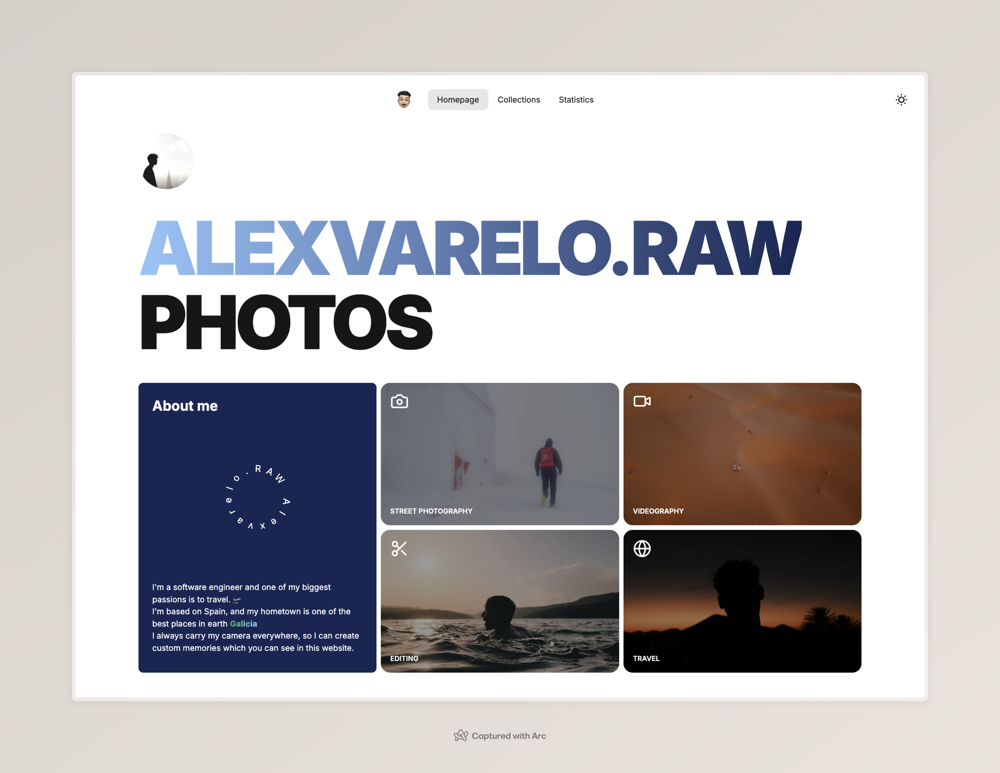
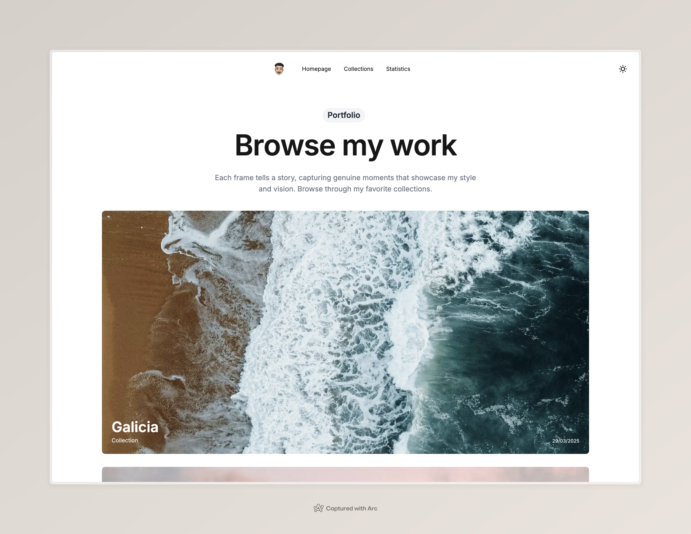
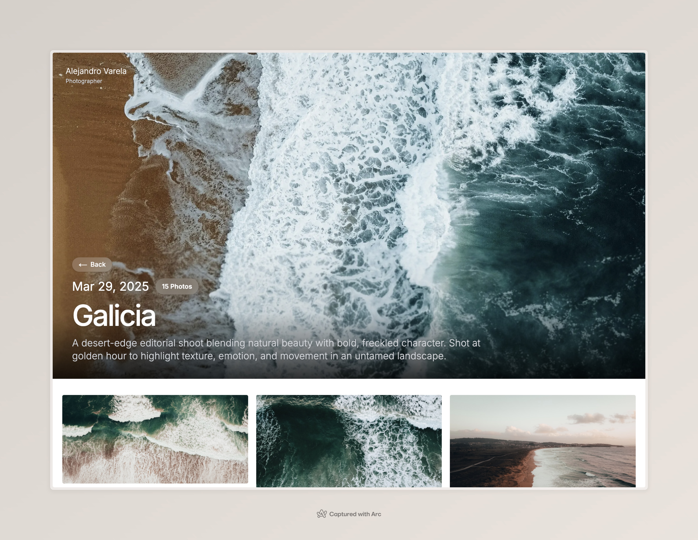

<div align="center">
  
  <h1>alexvarelo.raw — Photography portfolio </h1>
  <p><b>Showcasing photography with Next.js, Unsplash API, and a beautiful, animated UI.</b></p>
  
  <br/>
  
  <br/>
  
  <br/>
  
</div>

---

## 🚀 Stack

<ul>
  <li><b>Next.js 13+</b> (App Router, SSR, SSG, API routes)</li>
  <li><b>Tailwind CSS</b> (with DaisyUI)</li>
  <li><b>Framer Motion</b> (for smooth, modern animations)</li>
  <li><b>Unsplash API</b> (Open Platform, fully typed)</li>
  <li><b>Orval</b> (API client code generation)</li>
  <li><b>React Query</b> (data fetching/caching)</li>
  <li><b>Vercel</b> (deployment)</li>
  <li><b>MagicUI</b> (for advanced text animations)</li>
  <li><b>TypeScript</b> (strict, typed codebase)</li>
  <li><b>Next/Image</b> (optimized image handling)</li>
</ul>

---

## 📸 Unsplash API Integration

This project uses the <a href="https://unsplash.com/documentation" target="_blank">Unsplash Open Platform API</a> for all photo, collection, and user data.

### How it works

- <b>OpenAPI Spec</b>: The Unsplash API spec is stored in <code>src/apis/opapi/unsplashApiSpec.json</code>.
- <b>Orval</b>: We use <a href="https://orval.dev/" target="_blank">Orval</a> to generate a fully-typed API client from the OpenAPI spec.
  - Config: <code>src/apis/orval.config.json</code>
  - Generated code: <code>src/apis/generated/unsplashApi.ts</code> and <code>src/apis/generated/model/</code>
- <b>API Usage</b>: All data fetching (collections, photos, user profile, etc.) is done via the generated client, ensuring type safety and up-to-date endpoints.

```ts
import { useGetCollection, useGetCollectionPhotos } from '@/apis/generated/unsplashApi';

const { data: collectionInfo } = useGetCollection(collectionId);
const { data: collectionPhotos } = useGetCollectionPhotos(collectionId);
```

---

## 🖼️ Image Handling

- <b>Next.js <code>&lt;Image /&gt;</code></b> is used for all images, providing:
  - Automatic optimization (responsive, lazy loading, blur-up placeholder)
  - CDN support via Vercel
  - Blur placeholder using Unsplash's <code>blur_hash</code> for a smooth loading experience

```tsx
<Image
  src={photo.urls.raw}
  alt={photo.description}
  blurDataURL={photo.blur_hash}
  placeholder={photo.blur_hash ? "blur" : "empty"}
  fill
  className="object-cover w-full h-full"
/>
```

---

## ✨ UI/UX Features

<ul>
  <li><b>Animated Text</b>: Modern, animated headings using <a href="https://magicui.design/r/text-animate" target="_blank">MagicUI's TextAnimate</a></li>
  <li><b>Animated Image Gallery</b>: Images animate in as you scroll, using Framer Motion</li>
  <li><b>Responsive Design</b>: Fully mobile-friendly, with adaptive layouts and font sizes</li>
  <li><b>Glassmorphism</b>: Subtle glass effects on buttons and badges</li>
  <li><b>Dark/Light Mode</b>: Theme support via context and Tailwind</li>
</ul>

---

## 🗂️ Project Structure

<pre>
src/
  apis/
    generated/         # Orval-generated Unsplash API client
    opapi/             # OpenAPI spec for Unsplash
    orval.config.json  # Orval config
  app/
    collections/       # Collection pages and layouts
    landing/           # Landing page
    profile/           # Profile page
    ...
  components/
    images/            # Image gallery, grid, etc.
    text/              # Animated text, gradient text, etc.
    shared/            # Shared UI components
  constants/
  contexts/
  models/
  ...
public/
  next.svg, profile.jpg, etc.
</pre>

---

## 🛠️ Setup & Development

```bash
# 1. Install dependencies
npm install

# 2. Generate the Unsplash API client (if you update the OpenAPI spec)
npx orval --config src/apis/orval.config.json

# 3. Run the development server
npm run dev

# 4. Build for production
npm run build
```

---

## 🌐 Environment Variables

Create a <code>.env.local</code> file with your Unsplash API credentials:

```env
NEXT_PUBLIC_UNSPLASH_ACCESS_KEY=your_access_key
NEXT_PUBLIC_UNSPLASH_SECRET_KEY=your_secret_key
```

---

## 🖼️ Screenshots

### Landing Page


### Collections


### Collection Detail


### Statistics


---

## 🤝 Credits

<ul>
  <li><a href="https://unsplash.com/developers" target="_blank">Unsplash</a> for the API and images</li>
  <li><a href="https://orval.dev/" target="_blank">Orval</a> for API codegen</li>
  <li><a href="https://magicui.design/" target="_blank">MagicUI</a> for text animation</li>
  <li><a href="https://www.framer.com/motion/" target="_blank">Framer Motion</a> for animation</li>
  <li><a href="https://tailwindcss.com/" target="_blank">Tailwind CSS</a> and <a href="https://daisyui.com/" target="_blank">DaisyUI</a> for styling</li>
</ul>

---

## 📄 License

MIT

---

<sub>Built with ❤️ by Alejandro Varela. Inspired by modern portfolio templates and the Unsplash community.</sub>
